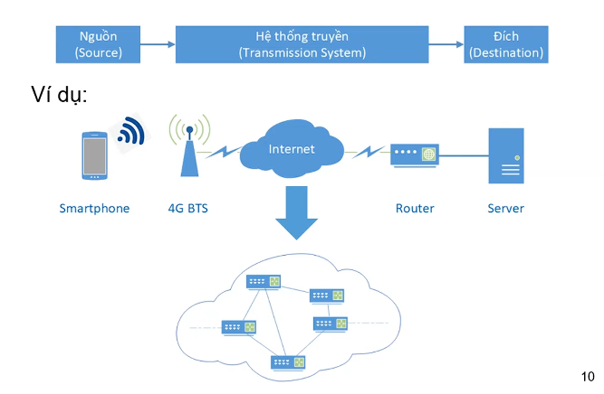
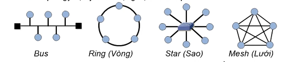

# **Tổng quan về mạng máy tính và truyền thông**
## **Mạng máy tính là gì?**

**- Tập hợp các máy tính kết nối với nhau dựa trên một kiến trúc nào đó để có thể trao đổi dữ liệu.**

## **Mô hình truyền thông**

- Trong quá trình truyền thông tin, có thể chuyển hóa thành 3 hệ thống
    - Hệ thống nguồn là nơi phát đi thông tin → thông tin qua hệ thống truyền dẫn → thông tin đến hệ thống đích (nhận thông tin).
    - Khi trao đổi hệ thống nguồn và hệ thống đích có thể trao đổi vai trò với nhau. (hai chiều)
- Ví dụ:  smartphone, máy tính, laptop, tivi, camera giám sát, ... được gọi là là **END SYSTEM** - là hệ thống đóng vai trò là hệ thống nguồn và hệ thống đích trong vai trò truyền dẫn thông tin

- **Hệ thống truyền (Transmission System)**: là các thiết bị mạng như modem, trạm phát sóng 4G BTS,...

**Đường truyền**

- **Đường truyền vật lý**: Là các phương tiện vật lý có khả năng truyền dẫn tín hiệu. 
    - Phân loại:
        - Hữu tuyến: cáp quang, cáp đồng trục, cáp xoắn,...
        - Vô tuyến: sóng radio, viba, sóng hồng ngoại,...

- **Một số đặc trưng**:
    - Băng tần: Độ rộng tần số tín hiệu có thể truyền đi
        - $f_{\min}$: tần số nhỏ nhất (khi $f_{\min}$ bắt đầu từ 0hz là băng tần cơ sở)
        -  $f_{\max}$: tần số lớn nhất
        - Băng tần = $f_{\max}$ - $f_{\min}$
        - *Ví dụ: Khi nói rằng đường truyền có băng tần là 1Mhz thì chúng ta có thể coi tần số tín hiệu có thể truyền đi một cách hiệu quả là từ 0 - 1Mhz, còn trên 1Mhz là không hiệu quả*
    - Tỉ lệ lỗi bit khi truyền (BER - Bit Error Rate/Raito)
        - Khi chúng ta truyền tín hiệu trên một đường truyền vì các lí do khác nhau thì tín hiệu sẽ bị nhiễu
        - **BER = Số bit lỗi / Tổng số bit truyền** 
        - *Ví dụ: với mạng internet thì BER ~ $10^{-9}$*
    - Độ suy hao: Mức suy giảm tín hiệu khi truyền *(Trong quá trình truyền tín hiệu sẽ bị suy hao năng lượng. Ở điểm càng xa với nguồn phát tín hiệu thì cường độ năng lượng càng thấp. Ví dụ: sử dụng wifi,...)*

## **Kiến trúc mạng**

- Kiến trúc mạng bao gồm **2 khía cạnh** :
    - **Topology (Hình trạng mạng):**
        *Topology vật lý:* hình trạng dựa trên cáp kết nối: hình bus, hình vòng, hình sao,...
        *Topology logic:* hình trạng dựa trên cách thức truyền tín hiệu: điểm - điểm, điểm - đa điểm (quảng bá)
    - **Protocol (Giao thức truyền thông):** là cách thức các thiết bị trong mạng trao đổi dữ liệu với nhau.
- Một vài ví dụ:
    - Mạng internet.
    - Mạng nội bộ cơ quan, trường học
    - Mạng gia đình
    - Hệ thống ATM của ngân hàng
    - Mạng điện thoại (4G, 5G,...)
    - ...

## **Phân loại mạng máy tính**

- **Mạng cá nhân (PAN - Personal Area Network):**
    - Phạm vi kết nối: và chục mét
    - Số lượng người dùng: một vài người.
    - Thường được phục vụ cho cá nhân
    - Công nghệ điển hình: Bluetooth, NFC, Transfer Jet,...

- **Mạng cục bộ (LAN - Local Area Network):**
    - Phạm vi kết nối: vài km
    - Số lượng người dùng: một vài đến hàng trăm nghìn.
    - Thường được phục vụ cho cá nhân, hộ gia đình, tổ chức
    - Công nghệ điển hình: Enthernet, Wifi, ...

- **Mạng đô thị (MAN - Metropolitian Area Network):**
    - Phạm vi kết nối: hàng trăm km
    - Số lượng người dùng: hàng triệu.
    - Thường được phục vụ cho thành phố, khu vực

- **Mạng diện rộng (WAN - Wide Area Network):**
    - Phạm vi kết nối: vài nghìn km
    - Số lượng người dùng: hàng tỉ.
    - GAN - Global Area Network: phạm vi toàn cầu (ví dụ internet)
    - Công nghệ điển hình: 3G/4G/5G, Wimax, GPON

## **Mạng Internet**
- Là hệ thống mạng có nhiều chục tỉ thiết bị kết nối
- **IoT - Internet of things**: là mô hình kết nối tất cả thiết bị vào trong các thiết bị internet. *Tiếng Việt: Internet vạn vật*.
- 